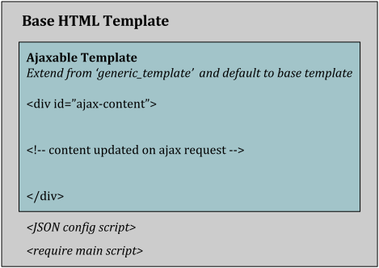

*******
Concept
*******

.. image:: _static/server_browser.svg
    :alt: server browser relations
    :width: 380
    :align: right

The idea is to create an interface between server side and client side classes that know how to communicate
with each other. This is done by creating a JS file with the same name as the `URL name`_ that is mapped to the
corresponding Django **view class**. `RequireJS`_ loads that file and it's class is executed automatically on request.

Client Side
===========

Since javascript doesn't support class definitions and inheritance I recommend using `coffeescript`_ or
`typescript`_ to simply inherit from ``ajaxviews.View`` class. You can still use javascript though by
using the built in ``extendjs`` function to mimic class inheritance.

.. code-block:: javascript
   :caption: my_view.js
   :name: javascript class

    define(['ajaxviews'], function(ajaxviews) {
      var MyView = ajaxviews.extendjs(ajaxviews.View);
      MyView.prototype.onLoad = function () {
        // access class instance variables and methods with 'this'
      };
      return MyView;
    });

.. MyView.prototype.onPageLoad = function () {
     // console.log('instance variables and methods: ', this);
     // executed on page load (init view)
   };
   MyView.prototype.onAjaxLoad = function () {
     // executed on ajax load (update view)
   };

.. container:: flex-grid

    .. code-block:: coffeescript
       :caption: my_view.coffee
       :name: coffeescript class

        define ['ajaxviews'], (ajaxviews) ->
          class MyView extends ajaxviews.View
            onLoad: ->
              # access class instance with '@'

    .. code-block:: typescript
       :caption: my_view.ts
       :name: typescript class

        define(['ajaxviews'], function(ajaxviews) {
          class MyView extends ajaxviews.View {
            onLoad() {
              // access class instance with 'this'
            }
          }
        }

.. onPageLoad: ->
     # executed on page load (init view)
   onAjaxLoad: ->
     # executed on ajax load (update view)

.. onPageLoad() {
     // executed on page load (init view)
   }
   onAjaxLoad() {
     // executed on ajax load (update view)
   }

For this to work you need to `set up RequireJS`_ and place the JS files inside the ``views`` directory which is
located in JS root. In ``main.js`` require the ``ajaxviews`` module and initialize the app.
The ``ajaxviews.App`` will execute the **view class** whose file name equals the **URL name** from
Django's *URL conf*.

.. code-block:: javascript
   :caption: main.js
   :name: main js file

    // setup require config

    require(['ajaxviews'], function(ajaxviews) {
      var App = ajaxviews.App;

      App.config({
        // options
      });

      App.init();
    });

Server Side
===========

The server side ``ajaxviews`` app provides views and mixins your views can inherit from.

.. container:: flex-grid

    .. code-block:: python
       :caption: urls.py
       :name: urls conf

        from django.conf.urls import url
        from .views import MyAjaxView

        urlpatterns = [
            url(r'^my/view/$', MyAjaxView.as_view(),
                name='my_view'),
        ]

    .. code-block:: python
       :caption: views.py
       :name: view classes

        from django.views.generic import View
        from ajaxviews.mixins import AjaxMixin

        class MyAjaxView(AjaxMixin, View):
            ajax_view = True

The ``AjaxMixin`` takes care of passing the **URL name** the view class is mapped to, to the client side app.
Add ``ajax_view = True`` to the class if you have created a corresponding JS file. If not you can omit the
``ajax_view`` property or set it to ``False``.

.. The client side **middleware** will always be executed.

.. code-block:: html
    :caption: base.html
    :name: base html template - JSON config

    

The **JSON config script** is the communication channel for sites requested via URL. It's included in the base
html template by the AjaxMiddleware_ along with the **require main script**.

.. code-block:: django
   :caption: base.html
   :name: base html template - require module

    
    

RequireJS loads the ``main.js`` file located in JS root. The module loading is handled by
`django-require`_'s templatetag ``require_module``.

.. code-block:: django

    

Extend templates from ``generic_template`` to be able to update the view via AJAX by calling ``requestView`` .
Set the default tag to the base template that's used for requests via URL. The ``#ajax-content`` is the
scope that's replaced when the view is updated.

.. raw:: html

    

.. _`URL name`: https://docs.djangoproject.com/en/dev/topics/http/urls/#naming-url-patterns

.. _RequireJS: http://requirejs.org

.. _coffeescript: http://coffeescript.org

.. _typescript: https://www.typescriptlang.org

.. _django-require: https://github.com/etianen/django-require

.. _set up RequireJS: setup.html#configure-requirejs

.. _AjaxMiddleware: setup.html#django-settings
